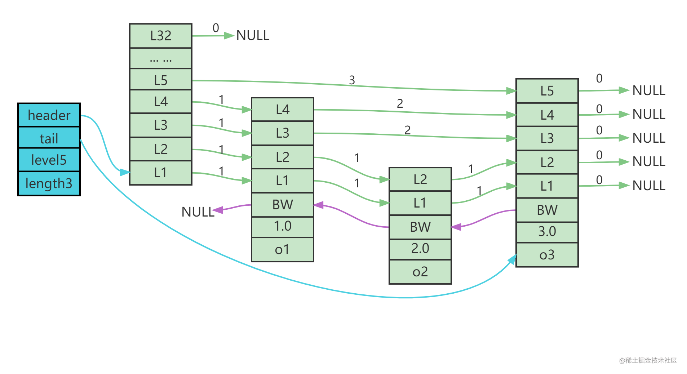

###  集合
####  线程安全的集合
##### ConcurrentHashMap
1. 保证多线程的方式：使用cas+synchronized对单节点进行加锁
2. 分桶加锁，只锁部分
#### 非线程安全的集合
##### HashMap
1. 底层实现：数组加（链表-红黑树）
2. 树的转换，阈值log(n)，n，8
3. 扩容：判断是否达到临界值达到则不扩容，未达到则扩容，扩容之后将原有数据移动到新的table中
##### List
1. 底层实现：
2. 扩容：
##### fail-fast
1. 在遍历时，如果容器元素被修改，就会报ConcurrentModificationException异常，并终止遍历
2. modCount：记录容器被修改次数，使用迭代器迭代时，modCount会被赋值给exceptedModCount
##### fail-safe
1. 支持在遍历时修改元素
2. copOnWriteArrayList
###  jvm
#### java内存区域
1. 堆：存放对象实例
2. 栈：虚拟机栈、本地方法栈
3. 方法区：存放已被虚拟机加载的类型信息、常量、静态变量
4. 运行常量池
5. 程序计数器
#### 分配内存的方式
1. 指针碰撞
2. 空闲列表
#### 对象创建
1. 接收new指令，常量池判断是否已经初始化
2. 执行类加载过程
   1. 加载：根据类的全限定名获取二进制流，将二进制流中的静态存储结构转换为运行时存储结构，生成class对象，作为类数据访问入口
   2. 验证：文件格式验证、元数据验证、字节码验证、符号引用验证
   3. 准备：为静态变量分配内存并进行初始化
   4. 解析：符号引用转换为直接引用
   5. 初始化
3. 分配内存空间
4. 初始化内存空间，值为0
5. 设置对象相关信息
6. 调用java构造方法进行资源填充
#### 对象访问方式
1. 句柄访问：在对象移动时，只改变句柄中实例数据指针，reference本身不需要改变，但需要经过一次转发，访问速度会有一定下降（Shendoah收集器，使用句柄访问）
2. 直接指针访问：节省一次指针定位时间开销，GC发生对象移动时，对应的reference信息需要同步更新
#### 垃圾回收算法
1. 标记清除
2. 标记整理
3. 复制算法
4. 分代收集
#### 垃圾回收器
1. Serial：单线程新生代复制算法
2. Serial Old：单线程老年代标记整理
3. ParNew：多线程复制算法
4. Parallel Scavenge：多线程复制算法，追求高吞吐量
5. Parallel Old：parallel scavenge 老年代多线程标记整理算法
6. CMS:标记清除
   1. 初始标记，STW
   2. 并发标记
   3. 重新标记
   4. 并发清除
   5. 问题：浮动垃圾、CPU敏感、浮动垃圾
7. G1
   1. 初始标记
   2. 并发标记
   3. 最终标记
   4. 筛选回收
8. ZGC
#### 空间分配担保机制
- 分配担保指老年代为新生代提供担保
#### JVM调优
##### 参数设置
1. 指定大对象阈值：-XX:PretenureSizeThreshold
2. 伪共享自动填充（配合@Contended注解使用）：-XX:-RestrictContended
3. 开启老年单空间分配担保：-XX:HandlePromotionFailure
###  java基础
#### 动态代理
1. jdk动态代理
   1. 设置需要代理的接口和实现类
   2. 创建代理类，实现InvocationHandler中的Invoke方法
   3. 通过Proxy.newProxyInstance(对象类加载器，对象所有接口，实现代理接口的类)构建基于需要代理类的新实例
   4. 调用方法
   5. 原理：实现被代理类的接口来完成动态代理，使用反射机制
2. cglib动态代理
   1. 创建需要代理的对象
   2. 创建拦截类实现MethodInterceptor
   3. 调用拦截类构造方法，传入代理对象(构建Enhancer对象，传入代理类的class对象，设置回调方法为拦截实例，创建实例)
   4. 执行方法
   5. 原理：通过修改字节码生成新的代理类来实现动态代理，使用过fastclass，final方法不能代理
#### java对象构成
1. 对象头
   1. Mark Word（标记字段）：
      1. 用于存储对象的hashcode、GC分代情况、锁状态信息、线程持有的锁、偏向线程id、偏向时间戳
   2. Klass Point（类型指针）
2. 实例数据
3. 对其填充
#### jdk1.7和1.8区别
1. 引入stream
2. hashmap优化
3. 永久代移除，变成元空间
4. 引入lambda表达式
5. 引入longadder、completeFuture、stampedLock
6. concurrenthashmap优化，引入分段锁

#### java引用
1. 强引用：如果一个对象持有强引用，那么垃圾回收器一定不会回收
2. 软引用：如果内存空间充足那么不会回收，否则会回收
3. 弱引用：在下次垃圾回收时一定会回收
4. 虚引用：等于没有持有引用，在任何时候都会被回收，用于跟踪对象被垃圾回收的活动

### 多线程
#### 锁
##### synchronized
1. 作用于静态方法，锁的是当前class对象
2. 修饰代码块，指定加锁对象给对象加锁
3. 修饰实例方法，给当前实例对象this加锁
4. MoniterEnter和MoniterExit对应同步块的进入和退出
5. ACC_SYNCHRONIZED关键字用于标记，是否需要获取锁（用在方法中flags）
6. 重量级锁的状态下（Synchronized为重量级锁），对象头指向堆中的monitor
7. 一个monitor(管程)对象包含cxq(下图中的ContentList),EntryList,WaitSet,owner
8. **当一个线程尝试获得锁时，如果该锁已经被占用，则会将该线程封装成一个ObjectWaiter对象插入到cxq的队列尾部，然后暂停当前线程。当持有锁的线程释放锁前，会将cxq中的所有元素移动到EntryList中去，并唤醒EntryList的队首线程。
    如果一个线程在同步块中调用了Object#wait方法，会将该线程对应的ObjectWaiter从EntryList移除并加入到WaitSet中，然后释放锁。当wait的线程被notify之后，会将对应的ObjectWaiter从WaitSet移动到EntryList中。**
    
##### 可重入锁和不可重入锁
##### 悲观锁和乐观锁
##### 公平锁和非公平锁
1. 公平锁遵循队列原则，按照排队顺序获取锁

2. 非公平锁则不按顺序，谁抢到就是谁的

##### 自旋锁与自适应锁
- 自旋锁
   1. 多核机器中，多个程序并行执行，如果当请求线程没有拿到锁，不挂起线程而是继续占用处理器时间，不断判断是否可以拿到锁
   2. 优点：不会发生线程切换，不会进入阻塞状态，减少了不必要的上下文切换，提高效率
   3. 缺点：长时间进入自旋，消耗CPU，使用不当会造成CPU使用率极高，属于不公平的锁，有可能造成线程饥饿
- 自适应锁：针对自旋锁的不足，如果一个线程在上一次执行过程中自旋成功，那么就会增加自旋次数，反之则会减少甚至省略掉自旋过程

##### 锁升级
1. 锁升级过程:无锁-偏向锁-轻量级锁-重量级锁
2. 当处于无锁对象时，markword存储的是对象hashcode，偏向锁为0
3. 线程1进入时，没有记录线程id信息，通过cas将自己的线程id加进去，此时偏向锁为1加锁成功
4. 线程2进入，查看记录线程id信息，不是自己的，说明已经偏向给其他线程，出现了竞争关系，尝试是否可以重偏向，如果不行，锁升级成轻量级锁，线程在自己的栈桢中创建lock record锁记录（包含对象分代年龄信息，原来的mark word会有一个指针），操作成功获取轻量级锁，操作完成只需要移除栈桢中的lock record即可
5. 设置失败，进行自旋，自旋达到一定次数（Adapative Self Spinning 设置自旋次数），升级成重量级锁
6. 向操作系统申请资源，线程挂起，进入等待队列，等待操作系统调度，从用户态切换到内核态
##### 锁消除和锁粗化
锁粗化：两块需要同步操作的代码之间，需要做一些其它的工作，而这些工作只会花费很少的时间，那么我们就可以把这些工作代码放入锁内，将两个同步代码块合并成一个，以降低多次锁请求、同步、释放带来的系统性能消耗
锁消除：锁消除是Java虚拟机在JIT编译时，通过对运行上下文的扫描，去除不可能存在共享资源竞争的锁，通过锁消除，可以节省毫无意义的请求锁时间

#### AQS
1. 基本参数
   1. state：记录重入次数
   2. head：队列的头结点
   3. tail：队列的尾结点
2. 拓展参数
   1. ConditionObject：用于存储条件队列

#### 逃逸分析
1. -XX:+DoEscapeAnalysis：开启逃逸分析
2. -XX:-DoEscapeAnalysis：关闭逃逸分析
3. 正常情况下java对象是在堆中分配的，但是在逃逸分析之后，发现对象没有逃逸处方法，那么可以在栈上分配
#### 死锁
1. 死锁的四个条件
   1. 请求与保持：进程占有一个资源，但仍需要申请资源-进程执行必须申请完所需使用的所有资源
   2. 不可剥夺：进程获取的资源，在未使用完之前不可以释放-进程如果没有获取到执行所需所有资源，放弃当前所持有资源
   3. 互斥条件：一个资源在同一个时刻只能由一个进程占有
   4. 循环等待：循环等待对方资源释放-设置资源获取顺序
2. 死锁检测
   - 死锁检测工具
      1. jstack
      2. jconsole
#### 多线程循环打印ABC
1. 使用锁：循环内部加锁，直接进行判断，满足条件的打印，设置全局变量
2. 使用锁：循环外部加锁，设置唤醒时机，不满足的继续等待
3. 信号量：保证同一时间只有一个线程可以执行，那么当前这个线程的信号量为1，执行完成之后释放当前线程信号量，指定下一个需要执行的信号量为1

#### ThreadLocal
1. 定义：线程本地变量
2. 在并发场景下多个线程修改一个共享变量使用，提高运行效率
3. 内部构造
   1. Thread内部有一个ThreadLocal.ThreadLocalMap()
   2. ThreadLocalMap内部维护了Entry数组，每个Entry代表一个完整对象，key是ThreadLocal本身，value是值
   3. ThreadLocal使用弱引用原因，Threadlocal在使用时threadLocal对象和Threadlocal都持有强引用，那么当threadlocal对象被回收时，threadlocalmap还持有该对象的强引用，无法回收，如果使用弱引用，那么则可以被回收，也正因为threadlocal对象在使用时持有threadloca强引用，所以即使使用弱引用也不会被回收
   4. 当threadlocal被回收时，key为null会导致value为空，但是引用存在，无法被回收，所以在set和remove等方法中含有清除此类值的逻辑

#### LongAdder
1. 底层使用一个cells数组
2. 当在执行add操作时，由于cas失败那么就会创建cells数组
3. 将当前需要加的值放入数组中
4. 在执行get操作时，获取cells数组内所有的结果相加
5. LongAccumulator补充LongAdder只能执行加减的不足
6. Contended用于解决伪共享，@sun.misc.Contended。加上这个注解的类会自动补齐缓存行，需要注意的是此注解默认是无效的，需要在jvm启动时设置-XX:-RestrictContended才会生效

#### 伪共享
1. MESI缓存一致性协议
2. 基于局部一致性原理，CPU cache在读取内存数据时，不会只读一个字或字节，而是一块一块读，每一块数据也叫cpu缓存行
3. 多个处理器核心修改同一个缓存行，有2种情况
   1. 修改同一个变量，CPU通过MESI机制维持两个核心缓存中的数据一致性，一个核心修改数据，需要向所有核心广播RFO请求，将其他核心的cache line设置已失效，需要将其他核心已修改数据写回内存，再读取
   2. 修改不同变量（变量处于同一个cache line中），同上，但是修改的数据不同，但是其他核心缓存的数据也会被刷，降低效率
4. 解决
   1. 缓存填充
   2. 分组

#### 线程池
##### 线程池的优点
1. 降低资源消耗：避免线程创建和销毁带来的额外资源消耗
2. 提高响应速度
3. 提高线程可管理性
##### 线程池基本参数
1. 核心线程数量
2. 最大线程数量
3. 队列
4. 最大等待时间
5. 时间格式
6. 创建线程工厂
7. 拒绝策略：当前线程执行，直接拒绝，拒绝抛出异常，队列满了丢弃最早进入队列的任务
##### 线程池执行过程
1. 线程池接收到任务，判断当前线程数是否大于核心线程数，如果小于，那么创建核心线程执行任务
2. 如果大于那么将其放入等待队列，如果等待队列满了，判断当前线程数是否大于最大线程数，如果没有，那么创建临时线程执行任务
3. 如果大于那么执行拒绝策略

#### IO密集型和CPU密集型
##### 解释
1. IO密集型：大部分时间在IO请求上，不需要CPU提供多大算力
2. CPU密集型：占用CPU算力大，希望能获得更长的时间轮片，而不是经常切换
##### 线程数设置
1. IO密集型：2n+1
2. CPU密集型：n+1
###  spring
#### bean的生命周期
1. spring在启动时通过注解或者xml文件扫描需要被spring管理的bean，将这些信息封装成beandefiniition，最后将这些信息放置在beanDefinitionMap中，key是beanName,value是beanDefinition
2. 遍历beanDefinitionMap，执行BeanFactoryPostProcessor这个bean工厂后置处理逻辑
3. 使用反射实例化对象
4. 注入相关属性-依赖注入
5. 是否实现aware接口，如果实现则填充相关资源
6. 销毁实例
7. 
#### 使用三级缓存解决循环依赖问题
1. 一级缓存，正式对象
2. 二级缓存，半成品对象
3. 三级缓存，工厂
#### 设计模式
1. 代理模式：AOP
2. 策略模式：AOP依据不同的场景使用不同的设计模式，DefaultAopProxyFactory中createAopProxy()函数
3. 装饰器模式：spring事务
4. 单例模式
5. 简单工厂模式：beanFactory,由工厂进行所有逻辑判断、实例创建，利用反射
6. 工厂方法模式：factoryBean，不同工厂生产不同产品
7. 观察者模式：事件
   - 观察者模式和发布订阅模式区别：是否有中间Broker处理发布内容，前者是松耦合，后者是完全解耦
8. 模板模式
9. 适配器模式

####  beanfactory和factorybean
1. spring最基础bean工厂，提供了管理bean的通用方法如getBean(),containsBean()
2. factoryBean是一个能生产或修饰对象生成的工厂Bean，类似于设计模式中的工厂模式和装饰器模式。它能在需要的时候生产一个对象，且不仅仅限于它自身，它能返回任何Bean的实例
3. 一个bean A实现了factoryBean，那么A就变成一个工厂了，根据A名称获取到的实例实际上是由工厂得getObject构建的，如果想调用自己的构造方法，那么需要在前面加上&
4. factoryBean应用：创建AOP的代理对象
5. beanFactory是spring容器顶层接口，factoryBean是用户自定义工厂接口

###  分布式
####  zookeeper
####  dubbo
#### redis
##### 快的原因
1. 完全基于内存，绝大部分请求时纯粹的内存操作
2. 数据结构简单
3. 采用单线程，避免不必要的上下文切换
4. IO多路复用模型，非阻塞IO
5. 基于自己构建的VM模型
##### 基本数据类型
1. 字符串
   - 底层数据结构：int和SDS（简单动态字符串）
   - SDS底层结构：len-记录buf已使用的长度，free-记录未使用的长度，buf-字节数组，用户保存的字符串
   - SDS与C字符串区别
      1. 杜绝缓冲区溢出，当SDS API需要对SDS进行修改时，API会先判断空间是否充足不足则扩容再修改
      2. 减少字符串修改带来的空间重新分配问题
         1. 空间预分配：如果SDS长度小于1M那么分配等同于len长度的空间，如果大于1M则会分配未使用空间1M
         2. 惰性空间释放：字符串需要缩短时不会立即使用重新分配来回收多余空间
      3. 二进制安全：C字符串需要符合编码规范，并且除了末尾之外不允许出现"\n"，redis的buf数组是用来保存一系列二进制数据（数据格式多样性）
   - 常用命令
      1. 设置值，不存在就插入：SETNX key value
      2. 查看数据过期时间：TTL key
      3. 设置值，并设置过期时间：SET name value EX time
      4. 设置值，不存在插入，并设置过期时间SET name value NX PX|EX(毫秒|秒) time
      5. 删除值：del name
2. 散列（hash）
   - 常用指令
      1. 获取哈希表所有的key：HKEYS key
      2. 活锁哈希表所有values：HVALS key 
      3. 判断哈希表指定值是否存在：HEXISTS key field
      4. 获取所有键值：HGETALL key
   - 使用场景
      1. 缓存对象
      2. 购物车
3. 列表（list）
   - 常用指令
      1. 列表左插入：LPUSH key fields
      2. 列表右插入：RPUSH key fields
      3. 获取列表长度：LLEN key
      4. 获取指定范围值：LRANGE startindex endindex
      5. 更新指定下标的值：LSET key index field
      6. 移动最后一个元素到destination列表：RPOPLPUSH key destination
      7. 截取指定范围：LTRIM key startindex endindex
      8. 截取某个元素，指定个数，精确匹配：LREM KEY num field
      9. 左边取出元素：LPOP KEY
      10. 右边取出元素：RPOP KEY
   - 使用场景
      1. 消息队列
         1. 消息可靠性：使用BRPOPLPUSH将消息取出并放入新的列表留存备份
         2. 重复消息：设置全局id再放入list中
         3. 消息有序，左存右取，使用BRPOP阻塞式读取，在没有读取到队列数据时，阻塞
4. 集合
   - 内部实现：哈希表或证书集合
   - 常用指令
       1. 存入元素：SADD key fields
       2. 删除元素：SREM KEY FIELD
       3. 获取集合所有元素：SMEMBERS key
       4. 获取元素个数：SCARD key
       5. 判断是否存在元素：SISMEMBER key field
       6. 随机选出count个元素：SRANDMEMBER key count
       7. 随机选出count个元素删除：SPOP key count
       8. 移动指定值到另一个集合：SMOVE source target field
   - 使用场景
       1. 点赞
       2. 共同关注
       3. 抽奖活动
5. 有序集合
   - 底层实现：压缩列表或跳表，如果有序集合元素个数小于129，并且每个元素值小于64字节，使用压缩列表，否则使用跳表，redis 7.0 压缩列表结构已经被废弃，交由listpack数据结构来实现
   - 常用命令
      1. 加入元素：ZADD key score field
      2. 获取范围内元素值：ZRANGE key startindex endindex
      3. 倒序获取所有有序集合：ZREVRANGE key startindex endindex
      4. 删除元素：ZREM KEY FIELD
      5. 返回元素分值：ZSCORE key field
      6. 加分值：ZINCRBY KEY SCORE field
   - 使用场景
      1. 排行榜
      2. 电话、姓名排序
##### 如何构建分布式锁
1. 基于单节点实现分布式锁
   - 保证原子性：使用LUA脚本或者使用SETNX命令
   - 业务运行异常造成死锁：设置锁过期时间
   - 客户端A加锁，B执行释放锁命令，将A锁释放，不同客户端设置唯一变量区分
2. 基于多节点实现分布式锁
   - 基本步骤
      1. 客户端获取当前时间
      2. 客户端按顺序依次向N个Redis实例执行加锁操作
      3. 客户端完成和所有redis实力加锁操作，计算总耗时（1. 超半数加锁成功；2.总耗时小于锁有效时长；满足两个条件才算加锁成功）
      4. 重新设置锁有效时长
##### 集群方案
1. 单机模式
   1. 采用单节点部署redis
   2. redis进程死亡之后，业务将无法调用redis服务
2. 主从模式
   1. 主从数据库同步
      1. 使用replicaof建立数据连接，并将主库数据同步到从库（设置完成之后从库只能读无法进行写操作），从库会给主库发送psync命令（包含主库runID和复制进度offset），主库执行bgsave命令，生成RDB文件，将文件发送给从库。从库接收RDB文件后，会先清理当前库，然后加载RDB文件
      2. 在同步期间，主库依旧可以接受请求，这些新的数据会被记录到replication buffer中，主库会把后续接收到所有命令在完成RDB同步后发送过去
   2. 主从网络中断
      1. 2.8之前采用全量复制，2.8开始采用增量复制方式同步
      2. 主从库断开之后，主库会把断联期间收到写命令写入replication buffer，同时会把这些写操作命令写入repl_backlog_buffer，这是一个环形缓冲区，主库会记录自己写的位置，从库会记录自己读到的位置
3. 哨兵机制
   1. 监控：哨兵进程在运行时，周期性的给所有主从库发送PING命令，检测是否仍然在线
      - 主观下线和客观下线，如果是从库简单标记为主观下线就好了，影响不大
      - 如果检测的是主库通常会采用多实例组成哨兵集群，只有大多数哨兵实例判断主库已经主观下线主库才会标记为客观下线
   2. 选主
      1. 主库标准：1.从库当前在线状态；2.网络连接状态
      2. 优先级最高的从库得分高
      3. 和旧主库同步程度最接近的从库得分高（repl_backlog_buffer复制进度，slave_repl_offset最接近master_repl_offset）
      4. ID号小的从库得分高
   3. 通知，通知从库重新执行replicaof命令
   4. 基于pub/sub机制的哨兵集群
      - sentinel monitor master-name ip redis-port quorum
   5. 哨兵如何知道从库ip和端口
      - 哨兵向主库发送INFO命令来获取
   6. 由哪个哨兵进行主从切换
      - 任何一个实例判定主库主观下线之后，就会给其他实例发送is-master-down-by-add命令，其他实例根据自己和主库连接状况做出Y或N响应
      - 选定执行哨兵；哨兵给其他哨兵发送命令，希望由自己完成主从切换，其他哨兵投票，1.拿到半数以上赞成表；2.拿到票数同时还需大于等于quorum值
      
4. 集群模式
##### 缓存替换策略
1. allkeys-lru|lfu：在所有key中使用lfu或者LRU算法进行回收
2. volatile-lru|lfu：从过期集合中使用LFU或者LRU算法进行回收
3. allkeys-random：从所有key中随机删除
4. volatile-random：从过期集合中随机删除
5. volatile-ttl：回收过期集合的键，并且优先回收存活时间最短的
6. noeviction：内存达到最大限制，返回错误
- FIFO：清除最先进入内存的数据
- LFU(最少使用)：优先清除使用频率最低的数据
- LRU(最久未使用)：清除内存中最久没有被访问的数据
##### 解决缓存与数据库数据不一致问题
##### 解决雪崩、击穿、穿透
1. 雪崩
   - 定义：大量应用请求无法在Redis中处理，紧接着大量请求落地数据库
   - 解决方案
      1. 优化缓存失效时间，为缓存添加随机时间
      2. 业务系统重实现服务熔断或请求限流机制
2. 击穿
   - 定义：针对某个访问频繁的热点数据请求，无法在缓存中处理，大量访问落地数据库
   - 解决方案
      1. 对于热点数据不设置过期时间
3. 穿透
   - 定义：访问一个不存在的数据，大量请求频繁访问数据库
   - 解决方案
      1. 对于不存在的数据缓存中存空
      2. 使用布隆过滤器
      3. 请求入口前端进行检验，过滤恶意请求
#### 消息中间件
##### 使用消息队列的场景
1. 应用解耦
2. 流量削峰
3. 异步处理
##### 解决消息丢失问题
1. 消息生产
   1. 做好try-catch，失败进行重试，重试次数过多，日志记录并告警
2. 消息存储
   1. 消息在刷盘之后在发送消息存储成功给生产者，对于多节点存储，则设置至少两个节点存储成功才标记为成功
3. 消息消费
   1. 在消息处理完成之后再发送消费成功
##### 重复消费问题
1. 消息发送先获取一个唯一id（活着token），发送给消费者，消费者根据这个唯一id判断是否已经处理
##### 保证消息的有序性
1. 全局有序
   1. 保证只能由一个生产者往一个topic发送消息，并且一个topic只能有一个队列，消费者使用单线程从队列中取出消息消费
2. 部分有序
   1. topic内部按照一定规则划分队列数，把消息按照特定的规则放入队列中，每个队列对应一个单线程消费者
##### 消息堆积
1. 原因：生产者与消费者速度不匹配
2. 解决
   1. 对于存在问题的定位问题
   2. 队列数设置不合理，水平扩容，增加队列数
### Mysql
#### sql的执行过程
#### 索引、B+树
##### B+树
1. InnoDB使用B+树作为索引模型，所有数据都存储在B+树中
2. 主键索引的B+树的叶子节点存储的是数据，非主键索引的B+树叶子节点存储的是主键索引的id
3. 使用非主键索引有一个回表的过程，但是如果查询的数据已经在索引中，那么久不需要回表，我们称之为覆盖索引
##### 索引下推
##### 最左前缀匹配原则
1. 假设构建了联合索引（a,b）那么实际上就构建了a索引和a,b索引
2. 索引跳跃扫描
   1. select选择的字段不能包含非索引字段
   2. sql中不能带group by或者distinct语法
   3. 仅限单表查询
   4. mysql优化器基于成本选择合适的执行计划，并不是所有忽略最左前缀的都走索引跳跃
#### binlog和redolog
#### 锁
#### 事务
##### 事务的特性
1. 原子性(Atomic)：一组事务要么全部成功要么全部失败
2. 一致性(Consistency)：不管事务发生的前后，数据变化一致
3. 独立性(Isolation)：多个事务之间独立
4. 持久性(Durability)：事务一旦提交，数据会被写入磁盘持久化处理
##### 脏读、幻读、不可重复读
- 脏读：一个事务读到了其他事务还未提交的数据
- 幻读：另一个失误在第一个事务要处理的目标数据你新增数据，然后先于第一个事务提交造成前后数据行数不一致
- 不可重复读：在一个事务中，多次读取统一数据，前后读取数据不一致
##### 事务的隔离级别
1. 读未提交
   - 定义：一个事务还没有提交他做的变更就会被其他事务看见
   - 实现：基于写互斥锁实现，由于读未采用互斥锁，所以会出现脏读、幻读、不可重复读问题，但是解决了脏写问题
2. 读已提交
   - 定义：事务提交之后做的变更才会被其他事务看见
   - 实现：写操作使用写互斥锁实现，对于读操作使用一种MVCC的多版本并发控制技术实现
3. 可重复读
4. 串行化
#### MVCC
##### 定义
多版本并发控制
##### 实现原理
1. InnoDB表的隐藏字段
   1. 隐藏主键：ROW_ID
   2. 删除标识：DELETED_BIT
   3. 最近更新的事务ID：TRX_ID
   4. 回滚指针：ROLL_PTR
2. InnoDB引擎的Undo-log：使用ROLL_PTR将存储的旧数据串联起来
3. ReadView：事务启动后，在首次执行select操作时，就会MVCC生产一个ReadView
   1. creator_trx_id：创建当前这个ReadView的事务id
   2. trx_ids：生成当前ReadView时，系统内活跃的事务ID（即未提交/回滚）列表
   3. up_limit_id：活跃列表最小的事务ID
   4. low_limit_id：生成当前ReadView时，系统中要分配的下一个事务ID
4. 实现

#### InnoDB和Myisam
##### Myisam
1. 在对锁的支持上，只支持表锁
2. 在事务支持上，Myisam不支持事务
3. 不支持外键
4. 允许没有主键的表存在
5. 不支持数据库崩溃恢复
6. 会记录最大自增主键在表数据的文件里
7. 使用非聚簇索引，索引和数据分开
8. Myisam用一个变量保存了表的行数
9. 在数据读取方面不占用大量内存和存储资源且速度快
##### InnoDB
1. 支持行级锁、表锁，但行锁只在使用索引时生效
2. 支持事务：使用redo log保证事务的持久性，使用undo log保证事务的原子性，使用锁机制、MVCC等手段来保证事务的隔离性
3. 支持外键
4. 支持数据库崩溃恢复（依赖于redo log、bin log、undo log）
5. 在8.0之后将自增主键最大值存储在redo log中
6. 不记录数据行数
7. 使用聚簇索引，主索引和数据存放在一个文件中
#### sql优化
#### 权限
### 数据结构
#### 一致性哈希算法
#### 跳跃表
##### 跳跃表构成
1. zskiplistNode：跳跃表节点
2. zskiplist：保存跳跃表节点信息
3. 
   1. 蓝色的是zskiplist结构
      - header：跳跃表头结点
      - tail：跳跃表尾节点
      - level：跳跃表层数
      - length：跳跃表长度
   2. 其他四个绿色的是zskiplistNode结构
      - level：包含前进指针和跨度
      - backward：后退指针
      - score：分值按照分值排序
      - object：成员对象
#### 压缩列表
##### 压缩表结构
1. zlbytes：记录整个压缩表占用的字节数
2. zltail：记录压缩表尾节点距离起始节点的字节距离
3. zllen：压缩表包含的节点数量
4. entry：压缩表的节点
   1. entry构成
      1. previous_entry_length：以字节为单位，记录前一个节点的长度，从表尾向表头遍历就是用这个实现的。当前一节点的长度小于254字节，previous_entry_length属性使用1字节长度的空间类保存长度值，如果大于或等于254字节，则使用5字节来保存长度-------连锁更新问题，假设entry1到entryn个节点，节点长度为250-253，如果此时在头部压入一个长度大于254节点，那么后续所有节点都需要扩容（扩容4个字节，整体则在254-257大于或等于254）
      2. encoding：记录节点的content属性所保存的数据类型以及长度
      3. content：节点的值
5. zlend：标记压缩表末端
### 网络
#### 网络分层模型

#### 三次握手四次挥手
1. 流程
   1. 客户端发送syn(建立连接)包(seq=x)到服务器，并进入SYN_SEND状态，等待服务器确认（客户端发送能力正常）
   2. 服务器收到syn包，发送确认接收ack(确认)(x+1),同时自己也发送SYN包(seq=y),服务器进入SYN_RECV状态（服务器接收能力和发送能力正常）
   3. 客户端收到SYN+ACK包，向服务器发送ACK(y+1)包，客户端和服务端进入ESTABLISHED状态，完成三次握手（客户端接收能力正常）
   
   4. 客户端发送FIN，用来关闭客户端到服务器的数据传送，此时还可以接收数据
   5. 服务器收到FIN包后，发送一个ACK给对方并且带上自己的序列号sel，确认序号为收到序号+1。此时服务器进入CLOSE-WAIT状态，此时处于半关闭状态，客户端没有数据发送，但是服务器若发送数据客户端依旧接收
   6. 服务器发送一个FIN，用来关闭服务器到客户端数据传输，等待客户端确认，服务器进入LAST_ACK状态
   7. 收到FIN后主动关闭，发送一个ACK给服务器，确认序号为收到序号+1，客户端进入TIME_WAIT状态，服务端关闭连接，经过2MSL后，客户端撤销相应TCB，进入CLOSED状态
   
   8. 2MSL的作用
      1. 保证客户端发送的最后一个ACK能够到达服务器，在这段时间内，服务器如果没有收到返回那么就会重新发送，重新计时
      2. 保证不会有旧的连接报文
#### TCP和UDP
- TCP
   1. 面向连接
   2. 仅支持单播传输
   3. 面向字节流
   4. 可靠传输
   5. 提供阻塞控制
   6. 提供全双工通信
- UDP
   1. 面向无连接
   2. 有单播、多播、广播功能
   3. 面向报文
   4. 不可靠
   5. 头部开销小，传输数据报文时高效
### 操作系统
#### IO多路复用
##### 定义
1. 一种同步IO模型，实现一个线程可以监控多个文件句柄
2. 一旦某个文件句柄就绪，就能够通知应用程序进行相应读写操作
3. 没有文件句柄就绪的就会阻塞应用程序，交出CPU
##### select
1. 用户线程调用select，将fd_set从用户空间复制到内核空间
2. 内核空间对fd_set进行扫描，将就绪文件描述符统计结果返回给用户线程
3. 如果统计数量大于0，用户线程再次对fd_set进行扫描，找出就绪文件描述符
4. 执行读写操作
- 优点：支持所有平台，跨平台性良好
- 缺点
   1. 大量拷贝操作
   2. 连接数有限制（最大文件描述符数量）
   3. 需要遍历fd_set（内核、用户都要遍历）
##### poll
基本与select相同
不同点在于采用链表存储而非数组（数组需要完整的空间，链表由于有头尾指针，所以无需在同一物理空间，没有大小限制）
##### epoll
1. epoll_create创建eventpoll对象（红黑树存储监控文件描述符、双向链表存储就绪文件描述符）
2. 红黑树存储监听的所有文件描述符，并且通过epoll_ctl对文件描述符进行删除和添加
3. 一个双链表存储就绪文件描述符列表，epoll_wait调用时，检测链表是否有数据，有直接返回
4. 所有添加到eventpoll中的事件与设备驱动程序建立回调关系
- 有点
   1. 时间复杂度O(1)
   2. 无需数据拷贝，使用内存映射技术
   3. 以回调的形式通知用户线程
#### 同步阻塞(BIO)
1. 服务端采用单线程，当accept一个请求后，在recv或send调用时阻塞，无法接受其他请求
2. 多线程模式，一个请求创建一个线程，资源浪费
#### 同步非阻塞(NIO)
1. 用户需要不断地调用，尝试读取数据，知道读取成功后，才继续处理接收的数据。
2. 整个IO请求的过程中，虽然用户线程每次发起IO请求后可以立即返回，但是为了等到数据，仍需要不断轮询、重复请求，消耗大量CPU资源
#### 异步IO模型(Asychronous IO)
1. 用户线程发起read系统调用，立刻就可以去做其他事情，用户线程不用阻塞
2. 内核就开始数据准备，数据准备完成之后将数据从内核缓冲区复制到用户缓冲区
3. 调用用户线程注册的回调接口或者给用户线程发送信号
4. 用户线程读取用户缓冲区数据，完成后续逻辑
5. 特点：在内核等待数据和复制数据阶段都不需要阻塞
6. 缺点：需要底层内核提供支持
